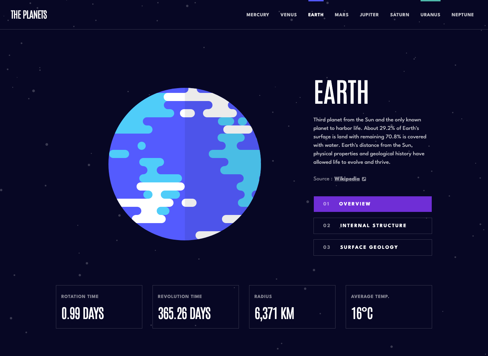

# Frontend Mentor - Planets fact site solution

This is a solution to the [Planets fact site challenge on Frontend Mentor](https://www.frontendmentor.io/challenges/planets-fact-site-gazqN8w_f). Frontend Mentor challenges help you improve your coding skills by building realistic projects.

## About the Project

The **"Planets Fact Site"** is an informative web application developed as part of a challenge, focusing on providing detailed facts about the planets in our solar system.

This project leverages _Next.js 15's App Router_ for routing and server-side capabilities, _TypeScript_ for type-safe development, and _Scss_ modules for component-specific styling. The site has been deployed as a _static generated site on GitHub Pages_, ensuring fast load times and SEO benefits.

## Preview and Links

| [Live Demo URL](https://ionstici.github.io/planets-fact-site) | [Frontend Mentor](https://www.frontendmentor.io/solutions/planets-fact-site-O8Ab8xzQOz) |
| ------------------------------------------------------------- | --------------------------------------------------------------------------------------- |

<details open>
<summary><b>Open Preview</b></summary>
<br>



</details>

## Features

- **Static Generation:** Deployed as a static site for performance and SEO optimization.
- **Detailed Planet Information:** Comprehensive facts about each planet presented in an engaging manner.
- **Responsive Design:** Built to look great and function smoothly on all devices.

## Built with

- **Next.js 15:** Utilizes the App Router for routing and server-side rendering.
- **TypeScript:** For improved development experience with type checking.
- **Scss Modules:** For efficient, component-level styling.

## Deployment

The site is statically generated and hosted on GitHub Pages, leveraging Next.js's export functionality for static site deployment.

## Getting Started

You will need [`Node.js & npm`](http://nodejs.org) installed on your computer for this project to run.

```bash
# Clone the repository
git clone https://github.com/ionStici/planets-fact-site.git

# Navigate to project directory
cd planets-fact-site

# Install dependencies
npm install

# Run development server
npm run dev
```

## Acknowledgements

Thank you to [**Frontend Mentor**](http://frontendmentor.io) for providing this educational challenge and to the [**Next.js**](http://nextjs.org) community for their documentation and support.

## License

This project is licensed under the MIT License. See [LICENSE](./LICENSE) file for more information.

## Contact

- [ionStici | GitHub](https://github.com/ionStici)
- [Ion Stici | LinkedIn](https://www.linkedin.com/in/ionstici)

Feel free to reach out if you have any questions or suggestions!
